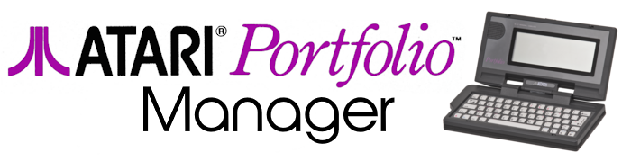
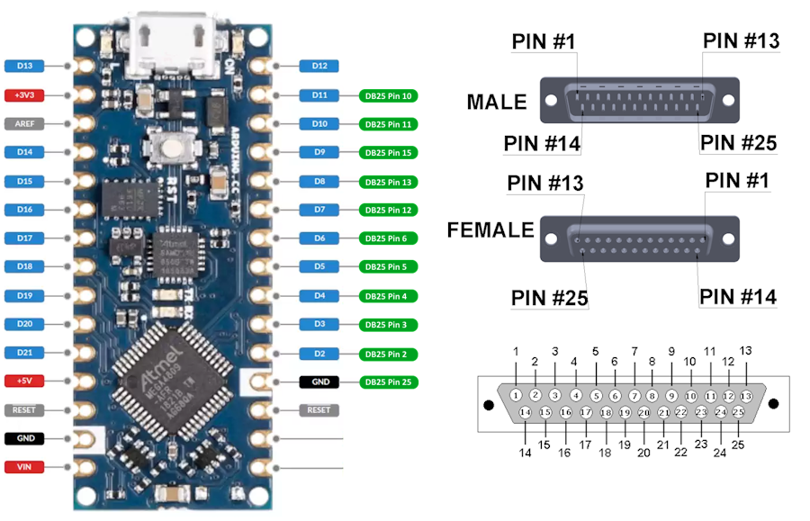

**Portfolio Manager** is an application for interfacing an [Atari Portfolio](https://en.wikipedia.org/wiki/Atari_Portfolio) vintage portable computer with your desktop PC.  It works together with an [Arduino](https://store.arduino.cc/pages/nano-family) to connect the Portfolio Parallel Interface Adapter to a USB port on your computer.  With this hardware, Portfolio Manger supports the internal file transfer protocol of the Portfolio.

## Requirements

To use this software you will need the following:

* An Atari Portfolio
* An Atari Parallel Interface Adapter
* An Arduino (Arduino Nano)
* A DB25 breakout board
* A PC running Windows

## Features

Support for all built-in Portfolio file transfer server features:
* Sending files to Portfolio
* Receiving files from Portfolio
* Listing files on the Portfolio

PofoManager also supports uploading pre-compiled firmware to a number of different Arduino models.

## Download and Install

You can download the latest release installer from here:

* [PofoManager v1.0.1](https://github.com/codaris/PofoManager/releases/download/v1.0.1/PofoManager.msi)

Download the above file and open it to install PofoManager on your computer.

## Arduino Connection Diagram

For compatibiltiy with the Atari Portfolio file transfer server it is only necessary to connect to pins 2, 3, 12, 13, and 25 on the DB25 connector.

| Arduino Pin | DB25 Pin | Server-Mode Usage |
|:-----------:|:--------:|-------------------|
|      2      |  **2**   | Output Data       |
|      3      |  **3**   | Output Clock      |
|      4      |    4     |                   |
|      5      |    5     |                   |
|      6      |    6     |                   |
|      7      |  **12**  | Input Clock       |
|      8      |  **13**  | Input Data        |
|      9      |    15    |                   |
|      10     |    11    |                   |
|      11     |    10    |                   |
|      GND    |  **25**  | Electrical Ground |

## Getting Help

You can get help with this application by using the [Issues](https://github.com/codaris/PofoManager/issues) tab in this project.

## Building the Project

This project consists of two parts, the **Arduino Firmware** that drives the connections to the Portfolio over the parallel port and the **PofoManager** desktop application that communicates with the Arduino over USB. 

#### Building the Arduino Firmware

The Arduino firmware is located in the [Arduino](https://github.com/codaris/PofoManager/tree/main/Arduino) directory of the project.  This can be built with the [Arduino IDE](https://www.arduino.cc/en/software) and installed directly onto an Arduino.  For this project, I've chosen an Arduino Nano but most models of Arduino should work without issue.  You can edit the [Porfolio.ino](https://github.com/codaris/PofoManager/blob/main/Arduino/Portfolio.ino) file to change the pin mapping if necessary.

#### Building PofoManager

The desktop component is written in C# for .NET 6.0.  It can be compiled by the community (free) edition of [Visual Studio 2022](https://visualstudio.microsoft.com/vs/community/).  Simply open the main solution file in the [PofoManager](https://github.com/codaris/PofoManager/tree/main/PofoManager) directory of the project and select `Build Solution`.

## Acknowledgements

* [Transfolio](https://github.com/skudi/transfolio) by Klaus Peichl
* [PofoDuino](https://github.com/peterstark-code/PofoDuino_Lite) 

