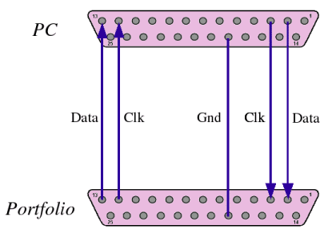
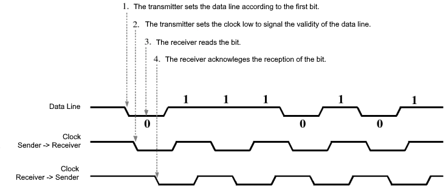

# Portfolio File Transfer Protocol

The [original documentation](http://www.pofowiki.de/doku.php?id=software:vorstellung:exchanges:transfolio) for the Portfolio file transfer protocol was written by Klaus Peichl on 2006-02-05.  This document is mostly an English translation of that article with some extra details infered from the [Transfolio](https://github.com/skudi/transfolio) source code.

## Introduction

The Atari Portfolio contains an built-in data transfer program that can be started from the setup menu and allows for data exchange with a PC.  This requires the parallel port module for the Portfolio and a straight-through male-to-male parallel cable to connect them (no cross overs).  Only pins 2, 3, 12, 13, and ground are necessary for the communication.  If you cross the transmit and receive lines then two Portfolios can communicate directly with each other.

The PC side requires software that can communicate with the Portfolio via the parallel port.  Software called `FT.COM` was provided on floppy disk that came with the parallel port module.  However, this software only works under DOS as it requires direct access to the parallel port.  For modern computers, a different solution is required.

Although the connection to a PC is made through the parallel port, the Portfolio only makes use of 4 of the lines.  This is because older PC parallel ports were unidirectional.  They were designed to send data to a printer with only a few control signals going back to the PC.  In order for the Portfolio to send data to a PC it uses two of those control signal lines: Paper End (`Pin 12`) and Select (`Pin 13`).  Communication from the PC to the Portfolio uses the lowest 2 data output lines (`Pin 2` and `Pin 3`).

## Transfer of a Byte

The data is clocked out one bit at a time.  From the perspective of the PC, `Pin 12` is the input clock and `Pin 13` is the input data.  `Pin 3` is the output clock and `Pin 2` is the output data.

A byte is transferred serially, starting with the highest-value bit. The data line controlled by the transmitter is switched to low level (0V) for a zero bit and for a one-bit to high level (5V). The other data line is unused and remains at low level. The clock lines are initially both at high levels. For each of the eight bits, the transfer can be divided into four steps. The diagram below shows the level curve for the active data line and the two clock lines when the byte value is `117`. Since both falling and rising flanks of the clock lines are used for signaling, the clock lines per byte take the low state four times.

To read the byte use the following pseudocode:

    Loop 4 times:
        Wait for INPUT_CLOCK to go LOW
        value = (value << 1) | INPUT_DATA
        Set OUTPUT_CLOCK to LOW
        Wait for INPUT_CLOCK to go HIGH
        value = (value << 1) | INPUT_DATA
        Set OUTPUT_CLOCK to HIGH

Sending a byte is done the same way.  It is recommended that you delay 50 microseconds between sending bytes.

## Synchronization

In order to communicate with the Portfolio, you need to synchronize the communication.  See the following pseudocode for how to synchronize:

    Wait for INPUT_CLOCK to go HIGH
    While (value != 0x5A):
        Wait for INPUT_CLOCK to go LOW
        Set OUTPUT_CLOCK to LOW
        Wait for INPUT_CLOCK to go HIGH
        Set OUTPUT_CLOCK to HIGH
        Read byte into value

A value of 0x5A indicates that the Portfolio file server is listening.

## Data Blocks

All data sending and receiving of data are done in blocks.  The Portfolio has a BIOS functions that any application can use to send and receive data this way.  These functions are used by the built in File Transfer Server.

### Sending a Block

To send a block if must first wait for the Portfolio to send a 0x5A byte.  While idle in Server mode the Portfolio will continuously send a stream of bytes: 0x5A, 0x69, 0xA5, 0x96.  If you receive any other bytes then the server is not idle.

A block starts with 0xA5, followed by 16bit length, the data, and a checksum.  The receiver will send the checksum back to indicate a successful transmission:

| Sender | Receiver | Comment |
|:------:|:--------:|---------|
|        |   0x5A   | Signals readiness to receive block 
|  0xA5  |          | Start of the data block
| n-Low  |          | Low-byte of block length in bytes 
| n-High |          | High-byte of block length in bytes
| Byte 1 |          | Data byte
| Byte 2 |          | Data byte
|  ...   |          | Data byte
| Byte n |          | Data byte
| Check  |          | Checksum
|        |  Check   | Confirmation of Checksum

To calculate the checksum, excluding the start of block indicator (0xA5) subtract all the data bytes and length bytes from 0 using unsigned 8-bit subtraction.  

### Receiving a Block

Receiving a block is simply the reverse of sending the block.  Send the value 0x5A to indicate that you want to receive a block from the Portfolio.  You will receive the 0xA5 to indicate the start of the block and the rest of the data as per the above.  You must send back the checksum to indicate that the block was successfully received. 

## Control Protocol

Files can be sent and received from the Portfolio, and directories listed, using the control protocol.  Each control protocol request is sent as blocks and responses returned as blocks.  Below is a list of control protocol requests and responses send as blocks.  Each request includes a buffer size; the Portfolio uses a default/maximum buffer size of 28,672 (0x7000) bytes but it may request a smaller buffer if there is unsufficient memory.  Responses should adhere to the buffer size requested.

### Request Directory Listing

The simplest feature is to request directory listing to a specific search path. The corresponding command sequence consists of a function code, the maximum receive buffer size, and the search pattern long up to 79 characters. If the search pattern is shorter than 79 characters, it must be terminated with a zero byte and the rest of the 82-byte data block must be added.

| Offset | Content | Description |
|:------:|:-------:|-------------|
|   0    |   0x06  | Function code "Request Directory Listing"
|   1    |   0x00  | Buffer size low
|   2    |   0x70  | Buffer size high
|   3    |   ...   | Search path string (e.g. C:*.*)
|  ...   |   ...   | Search path (len bytes)
| 3+len  |   0x00  | Null terminator
|  ...   |   ...   | Placeholder (content without meaning)
|   81   |   ...   | Placeholder (content without meaning)

 The result block contains the number of files found and their names separated by zero bytes. Further information such as the file length or the creation date is not available.

| Offset | Content | Description |
|:------:|:-------:|-------------|
|   0    |  n-Low  | Low-byte of number of files
|   1    |  n-High | High-byte of number of files
|   2    |   ...   | File name 1
|  ...   |   0x00  | Null terminator
|  ...   |   ...   | File name 2
|  ...   |   0x00  | Null terminator
|  ...   |   ...   | File name n
|  ...   |   0x00  | Null terminator
|  ...   |   0x00  | End of data marker

After the response has been sent, the portfolio is ready again and waiting for further commands.

### Request File

You can request a file from the Portfolio by sending the full path and file name of the file you want to retrieve:

| Offset | Content | Description |
|:------:|:-------:|-------------|
|   0    |   0x02  | Function code "Request File"
|   1    |   0x00  | Buffer size low
|   2    |   0x70  | Buffer size high
|   3    |   ...   | Path and file name (e.g. "C:\TEST.TXT")
|  ...   |   ...   | More path bytes
| 3+len  |   0x00  | Null terminator
|  ...   |   ...   | Placeholder (content without meaning)
|   81   |   ...   | Placeholder (content without meaning)

If the file doesn't exist, the Portfolio responds with a file not found reponse:

| Offset | Content | Description |
|:------:|:-------:|-------------|
|   0    |   0x21  | Response code "File not found"
|   1    |   0x00  | Buffer size low
|   2    |   0x03  | Buffer size high

If the file exists, the Portfolio responds with an 11-byte data block, which includes the file length:

| Offset |   Content  | Description |
|:------:|:----------:|-------------|
|   0    |    0x20    | Response code "File found"
|   1    |    0x00    | Buffer size low
|   2    |    0x70    | Buffer size high
|   3    |   t-Low    | File time (16 bit) in DOS format
|   4    |   t-High   | ...
|   5    |   d-Low    | File date (16 bit) in DOS format
|   6    |   d-High   | ...
|   7    |  n-LowLow  | File length (32 bit)
|   8    |  n-LowHigh | ...
|   9    |  n-HighLow | ... 
|   10   | n-HighHigh | ...

The transfer of the file data in one or more data blocks follows directly afterwards. The number of data blocks required depends on the file size and the buffer size of the portfolio. The buffer size, in turn, depends on the Portfolio's memory and is typically about 28,672 bytes (0x7000).

If all data blocks were received, the recipient completes the communication by the following data block:

| Offset | Content | Description |
|:------:|:-------:|-------------|
|   0    |   0x20  | Response code "File found" (OK)
|   1    |   0x00  | Buffer size low
|   2    |   0x03  | Buffer size high

### Send file

When a file is transferred to the Portfolio, a data block is sent first that contains all the file meta-data:

| Offset |   Content  | Description |
|:------:|:----------:|-------------|
|   0    |    0x03    | Function code "Send File"
|   1    |    0x00    | Buffer size low
|   2    |    0x70    | Buffer size high
|   3    |   t-Low    | File time (16 bit) in DOS format
|   4    |   t-High   | ...
|   5    |   d-Low    | File date (16 bit) in DOS format
|   6    |   d-High   | ...
|   7    |  n-LowLow  | File length (32 bit)
|   8    |  n-LowHigh | ...
|   9    |  n-HighLow | ... 
|   10   | n-HighHigh | ...
|   11   |    ...     | Full path a file name (e.g. "C:\TEST.TXT")
|   ...  |    ...     | ...
| 11+len |    0x00    | Null terminator
|   ...  |    ...     | Placeholder (content without meaning)
|   89   |    ...     | Placeholder (content without meaning)

If the file does not exist on the Portfolio, the server responds with the following block.  The block also contains the buffer size for the data blocks that follow:

| Offset | Content | Description |
|:------:|:-------:|-------------|
|   0    |   0x21  | Response code "File not found" (OK)
|   1    |   0x00  | Buffer size low
|   2    |   0x70  | Buffer size high

If the file already exists on the Portfolio, the server responds with the following block:

| Offset | Content | Description |
|:------:|:-------:|-------------|
|   0    |   0x20  | Response code "File found" (Error)
|   1    |   0x00  | Buffer size low
|   2    |   0x70  | Buffer size high

In this instance, you can signal that you want to overwrite the file by sending the following block:

| Offset | Content | Description |
|:------:|:-------:|-------------|
|   0    |   0x05  | Function code "Overwrite file"
|   1    |   0x00  | Buffer size low
|   2    |   0x70  | Buffer size high

If the overwriting is not desired, the file transfer can be terminated with the following block:

| Offset | Content | Description |
|:------:|:-------:|-------------|
|   0    |   0x00  | Function code "Overwrite file"
|   1    |   0x00  | Buffer size low
|   2    |   0x00  | Buffer size high

If the transfer has not been canceled, the payload data can now be sent in one or more blocks. The maximum block length depends on the buffer size, which was transmitted in the server's last response.

Once all data blocks have been successfully transferred, the server finally acknowledges again with a 3-Byte sequence:

| Offset | Content | Description |
|:------:|:-------:|-------------|
|   0    |   0x20  | Response code "File found" (Success)
|   1    |   ...   | ...
|   2    |   ...   | ...

