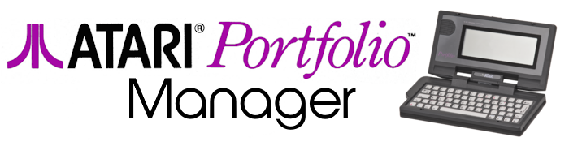

**Portfolio Manager** is an application for interfacing an Atari Portfolio vintage portable computer with your desktop PC.  
It works together with an Arduino to provide connect the Portfolio parallel interface adapter to a USB port on your computer.   
It supports the internal file transfer protocol of the Portfolio.

# Portfolio Manager.

Refer to [Markdown](http://daringfireball.net/projects/markdown/) for how to write markdown files.

## Quick Start Notes:

1. Add images to the *images* folder if the file is referencing an image.